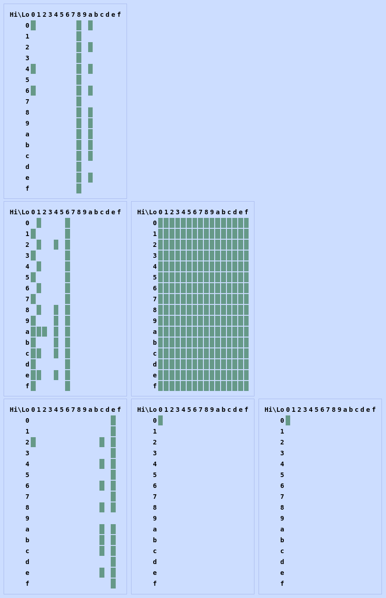

# ISAcrumbs

Wherein we take Ghidra SLEIGH processor specification files (.slaspec) and collect all possible instruction byte sequences.

Then what? We can visualize an instruction set's byte coverage as heatmaps, e.g. MOS 6502:



Rows are high 4-bits, columns are low 4-bits. Each set of heatmaps corresponds to the 1st byte of single byte instructions, then 1st and 2nd bytes of 2-byte instructions, etc. Only the first value of 16-bit operands is rendered.

## Usage

Ideally, this project would include in its classpath any required Ghidra classes. But instead, we just slap the source files directly in Ghidra's JUnit testing directory:
```sh
mkdir -p "$GHIDRA_INSTALL_DIR"/Ghidra/Framework/Emulation/src/test/java/ghidra/isacrumbs
cp ./java/ghidra/isacrumbs/*.java "$GHIDRA_INSTALL_DIR"/Ghidra/Framework/Emulation/src/test/java/ghidra/pcode/isacrumbs/
```

Build Ghidra dependencies and decompiler:
```sh
gradle -I gradle/support/fetchDependencies.gradle
gradle generateGrammarSource Decompiler:buildNatives
```

Output instruction patterns to `/tmp/out.json`:
```sh
gradle :Emulation:test --tests ghidra.isacrumbs.SleighInstructionsTest -x buildHelp -x sleighCompile
```

Output heatmaps to `/tmp/out.html`, and byte sequences to `/tmp/out.hex`:
```sh
./viz.py /tmp/out.json
```

Generated byte sequences can be validated with e.g. MAME's unidasm:
```sh
./unidasm /tmp/out.hex -arch m6502
```

## TODO

- Parse .pspec to include metadata for each ISA, enabling some statistics;
    - Colorize based on whether bits encode operands or instruction prefix;
    - With randomized mnemonics and operands, we can play a game of "ISAguessr";
- Visualize from binary bytes, or pcode emulator traces;
    - Contrast encodes % of ISA covered in a prefix;
- Alternative heatmap rendering with 256 rows \* columns:
    ```
    - 1-byte:        0..f * 0..f
    - 2-bytes:     00..ff * 00..ff
    - 3-bytes: 1st 00..ff * 2nd 00..ff, 2nd 00..ff * 3rd 00..ff
    - 4-bytes: 1st 00..ff * 2nd 00..ff, 2nd 00..ff * 3rd 00..ff + ...
    ```
